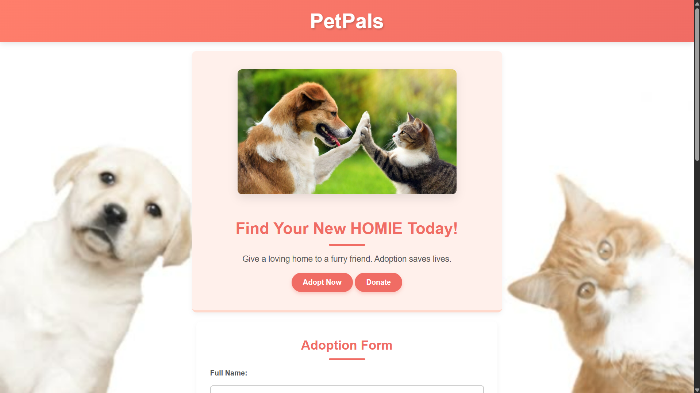

# 🐾 PetPals - Adopt Love

Welcome to **PetPals**, a simple yet engaging landing page designed to promote pet adoption and support for animal shelters. This project is part of a front-end internship task and showcases clean HTML and CSS practices, usability, and accessibility.

## 🌟 Features

- ✨ Hero section with an eye-catching image and call-to-action buttons  
- 🐶 Simple and functional **Adoption Form**  
- 📅 **Visit Scheduling** form for in-person appointments  
- ❤️ **Donation Section** with a clear message  
- 📱 Responsive layout for mobile and desktop screens

## 📸 Preview

## 🛠️ Technologies Used

- HTML5
- CSS3
  
## 📌 Future Improvements

- Add form validation and backend integration
- Improve accessibility for screen readers
- Include pet profiles and images
- Add animations for smoother user interaction

## Made by Shristi❤️

